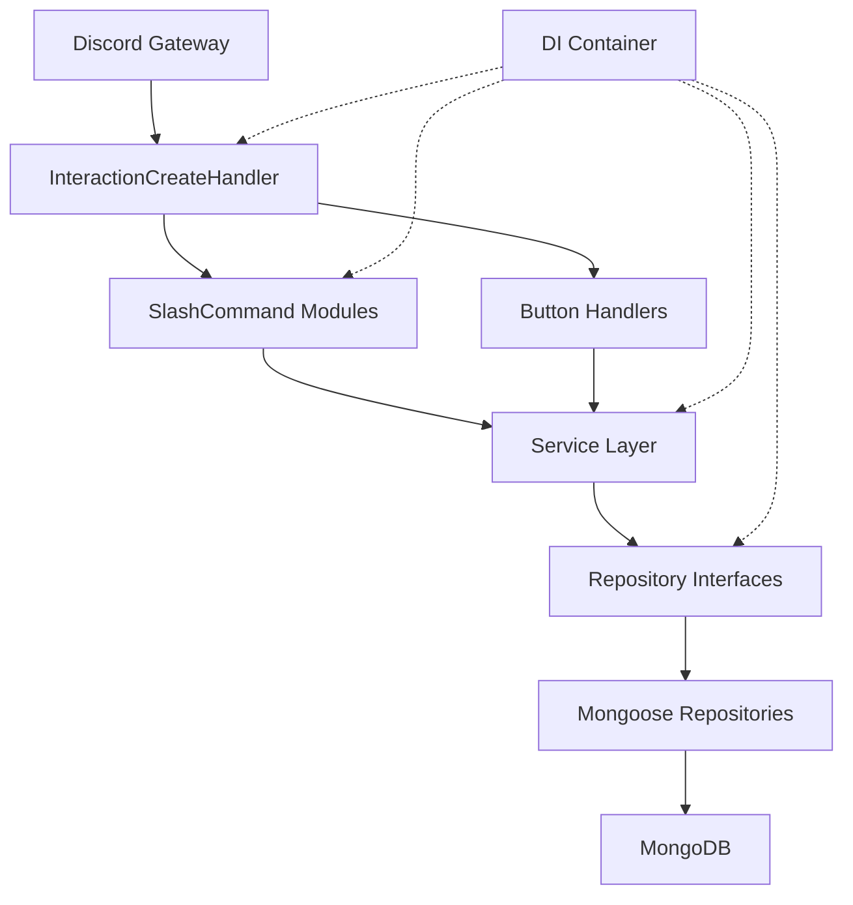
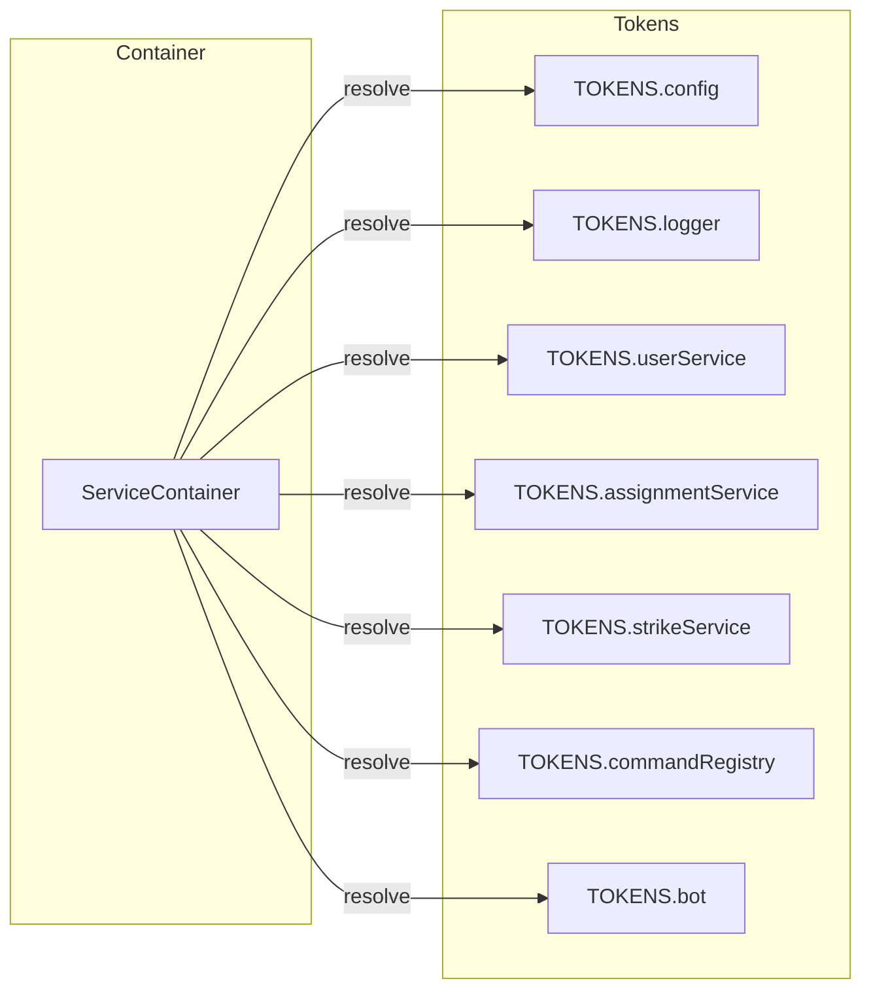
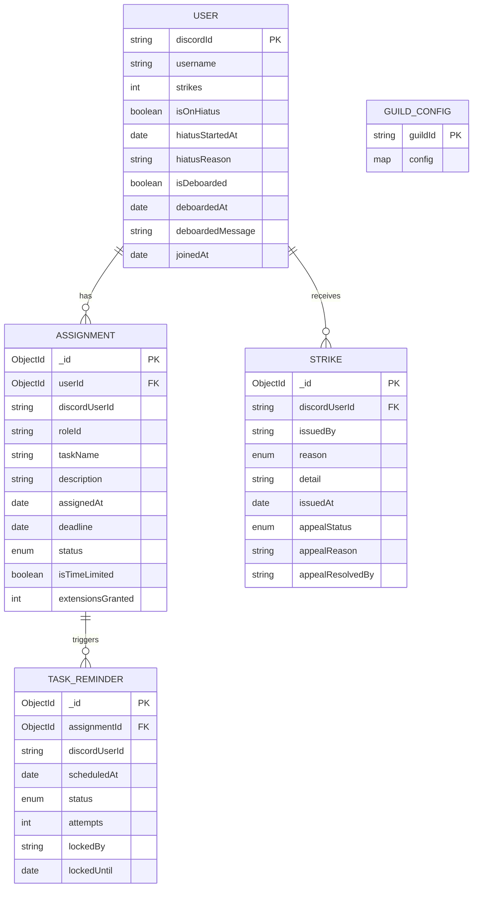
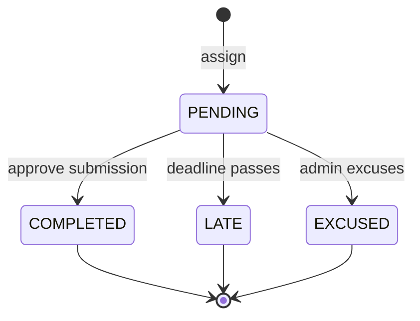
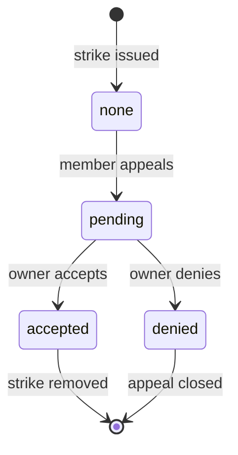
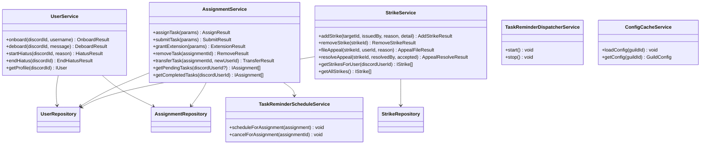
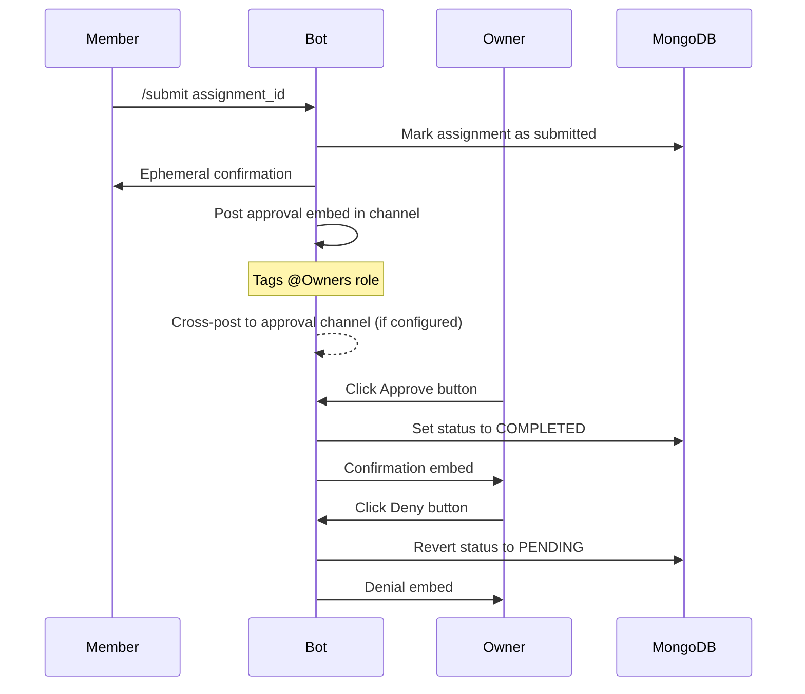
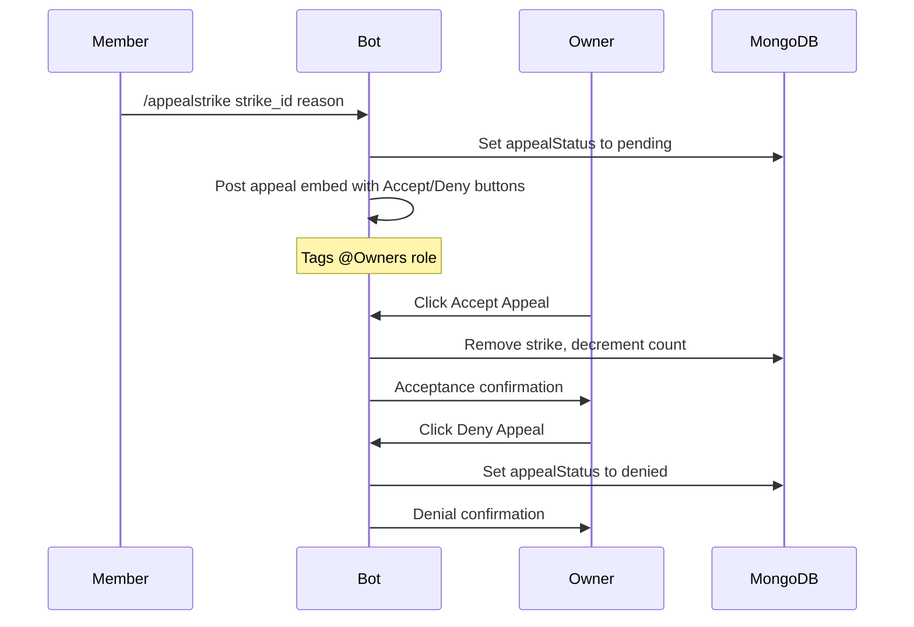
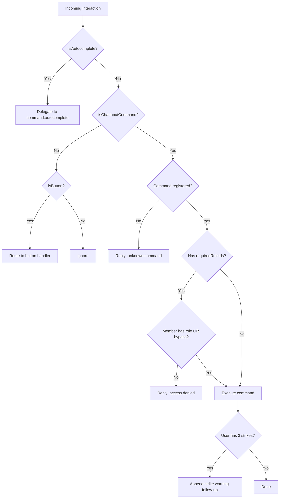
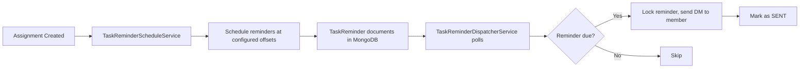

# Flower Sekai Miku

A production-grade Discord bot purpose-built for the **Flower Sekai** creative crew. It provides structured task management, crew coordination, a disciplinary strike system, and automated deadline reminders -- all surfaced through Discord slash commands with a distinctive Hatsune Miku-themed personality layer.

Flower Sekai Miku is a ground-up rewrite of the legacy Blossoming Sekai bot, redesigned around modern software engineering practices: strict TypeScript, dependency injection, the service-repository pattern, and comprehensive automated testing.

---

## Table of Contents

1. [Architecture Overview](#architecture-overview)
2. [Technology Stack](#technology-stack)
3. [Project Structure](#project-structure)
4. [Data Model](#data-model)
5. [Service Layer](#service-layer)
6. [Command Reference](#command-reference)
7. [Interaction Flow](#interaction-flow)
8. [Security Model](#security-model)
9. [Reminder System](#reminder-system)
10. [Configuration](#configuration)
11. [Getting Started](#getting-started)
12. [Running Tests](#running-tests)
13. [Deployment](#deployment)
14. [Adapting for Your Own Server](#adapting-for-your-own-server)
15. [Contributing](#contributing)
16. [License](#license)

---

## Architecture Overview

The bot follows a layered architecture with strict separation of concerns. Each layer communicates only with its immediate neighbor, ensuring testability and low coupling.



### Dependency Injection Container

All runtime dependencies are wired through a custom `ServiceContainer` using typed tokens. This enables singleton lifecycle management and constructor injection without a third-party DI framework.



---

## Technology Stack

| Layer | Technology | Version |
|---|---|---|
| Language | TypeScript (strict mode) | 5.8+ |
| Runtime | Node.js | 20.0+ |
| Discord Library | discord.js | 14.19+ |
| Database | MongoDB via Mongoose | 8.15+ |
| Date Parsing | chrono-node | 2.9+ |
| Testing | Vitest | 4.1+ |
| Module System | ESM (NodeNext resolution) | -- |

### Compiler Configuration

The project enforces the strictest TypeScript settings:

- `strict: true`
- `noUncheckedIndexedAccess: true`
- `exactOptionalPropertyTypes: true`
- `forceConsistentCasingInFileNames: true`
- Module resolution: `NodeNext` (all relative imports require `.js` extensions)

---

## Project Structure

```
src/
  app/                    # Bot entry point and lifecycle management
    bot.ts                # FlowerSekaiBot -- connects, loads commands, starts services
  bootstrap/              # Dependency injection wiring
    build-container.ts    # ServiceContainer registration for all tokens
  commands/
    contracts/            # SlashCommand interface, CommandExecutionContext
    handlers/             # InteractionCreateHandler, SubmitApprovalHandler, StrikeAppealHandler
    loader/               # CommandLoader -- populates the CommandRegistry
    modules/
      crew/               # Crew management commands (onboard, deboard, hiatus, strikes)
      tasks/              # Task lifecycle commands (assign, submit, extend, transfer, remove)
      utility/            # General-purpose commands (help, profile, ping, uptime, history)
    registry/             # CommandRegistry -- name-to-command lookup map
  config/
    constants.ts          # Default role IDs and specialized role labels
    env.ts                # AppConfig loader with validation and defaults
  core/
    di/                   # ServiceContainer and typed Token system
    logger/               # Structured logger with pluggable sinks
  database/
    connection.ts         # Mongoose connection management
  discord/
    command-deployer.ts   # Guild-scoped slash command deployment via REST API
  models/                 # Mongoose schemas and TypeScript interfaces
  presentation/
    miku-embed.ts         # Themed embed builder with Miku personality tones
  repositories/
    interfaces/           # Abstract repository contracts (UserRepository, etc.)
    mongoose/             # Concrete Mongoose implementations
  security/
    permission-bypass.ts  # Emergency bypass user list
  services/               # Business logic layer
  utils/                  # Shared utilities (username resolution, etc.)
tests/
  commands/               # Command-level integration tests
  config/                 # Environment loader tests
  core/                   # Logger tests
  helpers/                # Mock factories (createMockInteraction, createMockCommandContext)
  presentation/           # Embed builder tests
  security/               # Permission bypass tests
  services/               # Service-layer unit tests
```

---

## Data Model

### Entity Relationship Diagram



### Assignment Status Lifecycle



### Strike Appeal Lifecycle



---

## Service Layer

The service layer encapsulates all business logic and enforces invariants before interacting with repositories. Commands never access repositories directly.



---

## Command Reference

### Crew Management

| Command | Description | Access | Parameters |
|---|---|---|---|
| `/onboard` | Register a new crew member in the system | Everyone | `member` (User, required) |
| `/deboard` | Remove a crew member from the active roster | Owners | `member` (User, required), `message` (String, optional) |
| `/hiatus` | Place yourself on hiatus, freezing all deadlines and reminders | Everyone | `reason` (String, required) |
| `/endhiatus` | Return from hiatus, reactivating all deadlines | Everyone | -- |
| `/strike` | Issue a strike to a crew member | Owners | `member` (User, required), `reason` (late/misc, required), `detail` (String, optional) |
| `/removestrike` | Remove a strike from a crew member | Owners | `strike_id` (String, autocomplete, required), `reason` (String, required) |
| `/appealstrike` | Appeal a strike you received | Everyone | `strike_id` (String, autocomplete, required), `reason` (String, required) |

### Task Lifecycle

| Command | Description | Access | Parameters |
|---|---|---|---|
| `/assign` | Assign a task to a crew member with a deadline | Owners and Mods | `member` (User), `task` (String), `deadline` (String, natural language), `role` (String, choices), `description` (String, optional), `time_limited` (Boolean, optional) |
| `/submit` | Submit a pending task for owner approval | Everyone | `assignment_id` (String, autocomplete, required) |
| `/extend` | Request a deadline extension for a pending task | Everyone | `assignment_id` (String, autocomplete, required), `new_deadline` (String, natural language, required) |
| `/remove-task` | Remove a pending assignment entirely | Owners and Mods | `assignment_id` (String, autocomplete, required) |
| `/transfer-task` | Transfer a pending assignment to another crew member | Owners and Mods | `assignment_id` (String, autocomplete, required), `new_member` (User, required) |
| `/tasks` | View all pending tasks, optionally filtered by member | Owners and Mods | `member` (User, optional) |

### Utility

| Command | Description | Access | Parameters |
|---|---|---|---|
| `/help` | Browse all commands or view details on a specific one | Everyone | `command` (String, autocomplete, optional) |
| `/profile` | View your crew profile, assignments, strikes, and hiatus status | Everyone | `member` (User, optional) |
| `/history` | View completed task history for a member | Everyone | `member` (User, optional), `role` (String, choices, optional) |
| `/checkfree` | List crew members who currently have no pending tasks | Everyone | -- |
| `/ping` | Check bot and API latency | Everyone | -- |
| `/uptime` | Display the bot's current uptime | Everyone | -- |
| `/hello` | A quick greeting from Miku | Everyone | -- |

### Autocomplete

Commands that accept IDs (`assignment_id`, `strike_id`, `command`) provide dynamic autocomplete suggestions. The autocomplete system queries live data and presents human-readable labels:

- Task commands show: `Task Name -- due May 24` or `Task Name -- Username`
- Strike commands show: `Username -- Late (May 7)` or `Late Submission -- detail (May 5)`
- Help command shows: `/commandname -- description`

All autocomplete results are capped at 25 entries per Discord API constraints.

---

## Interaction Flow

### Task Submission and Approval



### Strike Appeal Flow



### Command Routing



---

## Security Model

### Role-Based Access Control

Commands declare access requirements through the `requiredRoleIds` property on the `SlashCommand` interface. The `InteractionCreateHandler` enforces this before execution:

1. If the command has no `requiredRoleIds`, it is available to all guild members.
2. If the command has `requiredRoleIds`, the handler fetches the member's guild roles and checks for at least one match.
3. Users in the **permission bypass list** skip the role check entirely.

### Owner-Only Commands

Some commands (e.g., `/strike`, `/removestrike`) perform an additional inline owner check via the `ensureOwnerAccess` helper, which verifies the invoking user holds the configured Owners role ID.

### Permission Bypass

A hardcoded set of Discord user IDs in `security/permission-bypass.ts` grants unconditional access to all role-gated commands. This serves as an emergency override mechanism for server administrators.

---

## Reminder System

The bot includes a fully automated task reminder pipeline:



### Configuration

| Variable | Default | Description |
|---|---|---|
| `REMINDERS_ENABLED` | `true` | Master toggle for the reminder system |
| `REMINDER_OFFSETS_MINUTES` | `1440,360,60,0` | Comma-separated list of minutes before deadline to send reminders (24h, 6h, 1h, at deadline) |
| `REMINDER_POLL_INTERVAL_MS` | `30000` | How often the dispatcher checks for due reminders |
| `REMINDER_BATCH_SIZE` | `25` | Maximum reminders processed per poll cycle |
| `REMINDER_LOCK_DURATION_MS` | `60000` | Lock duration to prevent duplicate processing |
| `REMINDER_MAX_ATTEMPTS` | `5` | Maximum send attempts before a reminder is abandoned |

### Hiatus Integration

When a member enters hiatus via `/hiatus`, all their pending reminders are frozen. Reminders resume automatically when the member returns via `/endhiatus`.

---

## Configuration

### Required Environment Variables

| Variable | Description |
|---|---|
| `DISCORD_TOKEN` | Bot token from the Discord Developer Portal |
| `DISCORD_APPLICATION_ID` | Application ID from the Discord Developer Portal |
| `DISCORD_GUILD_ID` or `GUILD_ID` | Target guild (server) ID for command deployment |
| `MONGODB_URI` | MongoDB connection string |

### Optional Environment Variables

| Variable | Default | Description |
|---|---|---|
| `APPROVAL_CHANNEL_ID` | `null` | Channel for cross-posting submission approval embeds |
| `REMINDERS_CHANNEL_ID` | `null` | Channel for reminder-related system messages |
| `LOGS_CHANNEL_ID` | `null` | Channel for structured log forwarding (strikes, system events) |
| `ROLE_OWNER_ID` | Flower Sekai default | Override the Owners role ID |
| `ROLE_MOD_ID` | Flower Sekai default | Override the Mods role ID |
| `ROLE_CREW_ID` | Flower Sekai default | Override the Crew role ID |
| `ROLE_VOICE_ACTOR_ID` | Flower Sekai default | Override specialized role ID |
| `ROLE_SVA_ID` | Flower Sekai default | Override specialized role ID |
| `ROLE_BVA_ID` | Flower Sekai default | Override specialized role ID |
| `ROLE_ARTIST_ID` | Flower Sekai default | Override specialized role ID |
| `ROLE_EDITOR_ID` | Flower Sekai default | Override specialized role ID |
| `ROLE_DESIGNER_ID` | Flower Sekai default | Override specialized role ID |
| `ROLE_GFX_ID` | Flower Sekai default | Override specialized role ID |
| `ROLE_CARD_EDITOR_ID` | Flower Sekai default | Override specialized role ID |
| `ROLE_TRANSLYRICIST_ID` | Flower Sekai default | Override specialized role ID |
| `ROLE_VOCAL_GUIDE_ID` | Flower Sekai default | Override specialized role ID |
| `MAX_STANDARD_EXTENSIONS` | unlimited | Maximum deadline extensions per assignment |
| `BLOCK_TIME_LIMITED_AUTO_EXTENSION` | `true` | Prevent extensions on time-limited assignments |

### Example `.env` File

```env
DISCORD_TOKEN=your-bot-token
DISCORD_APPLICATION_ID=your-app-id
GUILD_ID=your-guild-id
MONGODB_URI=mongodb://localhost:27017/flower-sekai-miku

APPROVAL_CHANNEL_ID=1234567890123456789
LOGS_CHANNEL_ID=1234567890123456789
REMINDERS_CHANNEL_ID=1234567890123456789

REMINDERS_ENABLED=true
REMINDER_OFFSETS_MINUTES=1440,360,60,0
```

---

## Getting Started

### Prerequisites

- Node.js 20.0 or later
- MongoDB instance (local or Atlas)
- A Discord bot application with the following:
  - `applications.commands` scope
  - `bot` scope with `Send Messages`, `Use Slash Commands`, and `Embed Links` permissions

### Installation

```bash
git clone https://github.com/Azaken1248/Flower-Sekai-Miku.git
cd Flower-Sekai-Miku
npm install
```

### Configuration

Create a `.env` file in the project root with the required variables listed in the [Configuration](#configuration) section.

### Build and Run

```bash
# Compile TypeScript
npm run build

# Start the bot
npm start
```

### Development Mode

```bash
# Hot-reload development server
npm run dev
```

---

## Running Tests

The project uses Vitest with a comprehensive mock infrastructure. All tests run without a database or Discord connection.

```bash
# Run all tests once
npm run test:run

# Run tests in watch mode
npm test

# Type-check without emitting
npm run typecheck
```

### Test Coverage Summary

| Area | Test Files | Description |
|---|---|---|
| Services | 4 files | UserService, AssignmentService, StrikeService, ReminderServices |
| Commands | 9 files | All command modules, interaction handler, infrastructure |
| Config | 1 file | Environment variable loading and validation |
| Core | 1 file | Logger sink registration and dispatching |
| Presentation | 1 file | Miku embed builder tone and field rendering |
| Security | 1 file | Permission bypass resolution |

---

## Deployment

### Production Deployment

1. Set all required environment variables on your host.
2. Build the project: `npm run build`
3. Start the process: `npm start`
4. Slash commands deploy automatically on bot startup to the configured guild.

### Process Management

For production environments, use a process manager such as PM2:

```bash
npm run build
pm2 start dist/index.js --name flower-sekai-miku
```

### Docker (Example)

```dockerfile
FROM node:20-alpine
WORKDIR /app
COPY package*.json ./
RUN npm ci --omit=dev
COPY dist/ ./dist/
CMD ["node", "dist/index.js"]
```

---

## Adapting for Your Own Server

Flower Sekai Miku is designed for the Flower Sekai Discord server, but the architecture is fully configurable for any creative team or project management server.

### Steps to Adapt

1. **Clone and install** the repository.

2. **Set your role IDs.** Override every `ROLE_*_ID` environment variable to match your server's role structure. The specialized roles (Artist, Editor, etc.) map to your team's discipline categories.

3. **Set your channel IDs.** Configure `APPROVAL_CHANNEL_ID`, `LOGS_CHANNEL_ID`, and `REMINDERS_CHANNEL_ID` to point to your server's channels.

4. **Update specialized roles.** If your team uses different role categories than the defaults (Voice Actor, SVA, BVA, Artist, Editor, Designer, GFX, Card Editor, Translyricist, Vocal Guide), modify `src/config/constants.ts` to define your own `SpecializedRoleKey` union type and labels.

5. **Update the permission bypass list.** Edit `src/security/permission-bypass.ts` to include your own admin user IDs.

6. **Customize the personality layer.** The Miku-themed embed builder in `src/presentation/miku-embed.ts` provides the bot's voice. Modify the tone definitions, color palette, and voice-wrap text to match your brand.

### Specialized Role Architecture

The bot maps each task assignment to a specialized role, allowing filtered views and targeted history queries. To add or remove specialized roles:

1. Update the `DEFAULT_SPECIALIZED_ROLE_IDS` object in `src/config/constants.ts`.
2. Update the `SPECIALIZED_ROLE_LABELS` object in the same file.
3. Add corresponding `ROLE_*_ID` environment variable entries (optional -- defaults will be used).
4. The `/assign` command's role dropdown and `/history` command's role filter will automatically reflect the changes.

---

## Contributing

Contributions are welcome. Please follow these guidelines to maintain the project's engineering standards.

### Development Workflow

1. Fork the repository and create a feature branch from `main`.
2. Write your changes following the existing code patterns:
   - All new code must be in TypeScript strict mode.
   - Relative imports must use `.js` extensions (NodeNext module resolution).
   - Services must never import from `mongoose` directly -- use repository interfaces.
   - Commands must implement the `SlashCommand` interface.
3. Add or update tests for any modified logic. All tests must pass before submitting.
4. Run the full validation suite:

```bash
npm run typecheck
npm run test:run
npm run build
```

5. Submit a pull request with a clear description of the changes.

### Adding a New Command

1. Create a new file in the appropriate `src/commands/modules/` subdirectory.
2. Implement the `SlashCommand` interface:

```typescript
import {
  type ChatInputCommandInteraction,
  SlashCommandBuilder,
  type SlashCommandOptionsOnlyBuilder,
} from "discord.js";

import type { CommandExecutionContext } from "../../contracts/command-execution-context.js";
import type { SlashCommand } from "../../contracts/slash-command.js";

export class MyCommand implements SlashCommand {
  readonly data: SlashCommandBuilder | SlashCommandOptionsOnlyBuilder = new SlashCommandBuilder()
    .setName("mycommand")
    .setDescription("Description of what this command does.");

  // Optional: restrict to specific roles
  // readonly requiredRoleIds: readonly string[];

  async execute(
    interaction: ChatInputCommandInteraction,
    context: CommandExecutionContext,
  ): Promise<void> {
    // Command logic here
  }

  // Optional: implement autocomplete for string options
  // async autocomplete(interaction, context): Promise<void> { ... }
}
```

3. Register the command in `src/commands/modules/index.ts` by adding it to the `buildCommandModules` return array.
4. The command will automatically appear in `/help`, be deployed to Discord on startup, and be routable by the interaction handler.

### Code Style

- No semicolon-free code. The project uses semicolons consistently.
- Use `readonly` on all class properties that do not change after construction.
- Prefer `type` imports for interfaces and types.
- All public service methods return typed result objects (e.g., `AddStrikeResult`, `OnboardResult`) rather than throwing exceptions for expected failure cases.

### Testing Conventions

- Mock factories live in `tests/helpers/mocks.ts`.
- Use `createMockInteraction()` for command interaction mocks.
- Use `createMockCommandContext()` for service-layer context mocks.
- Test files mirror the source structure: `tests/commands/`, `tests/services/`, etc.

---

## License

ISC
